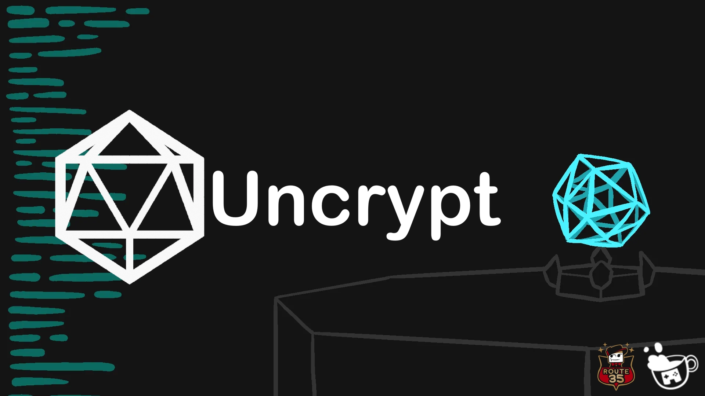
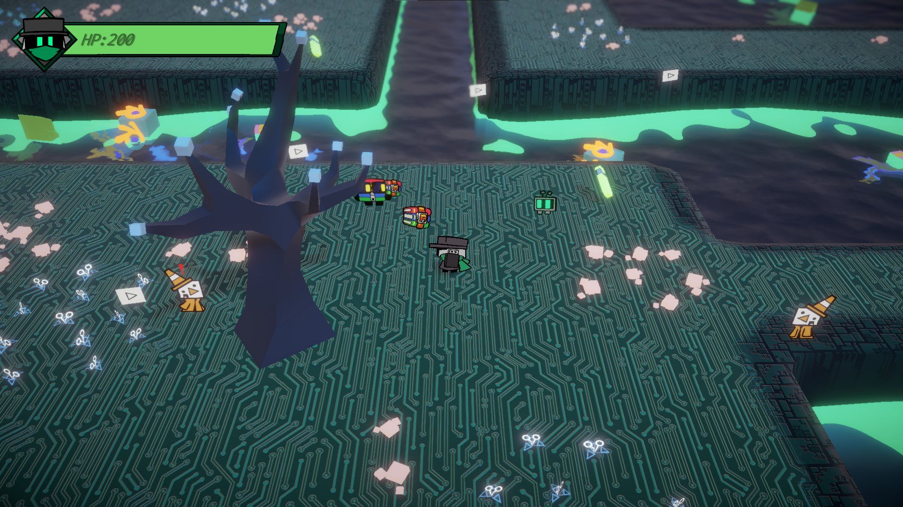
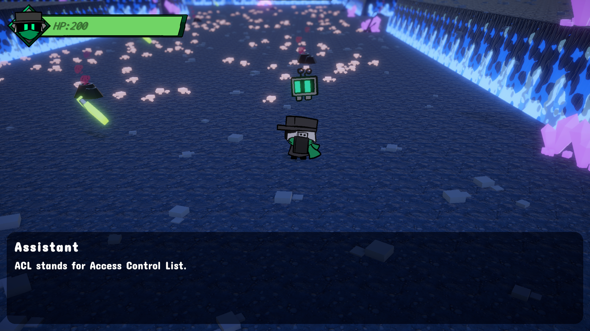
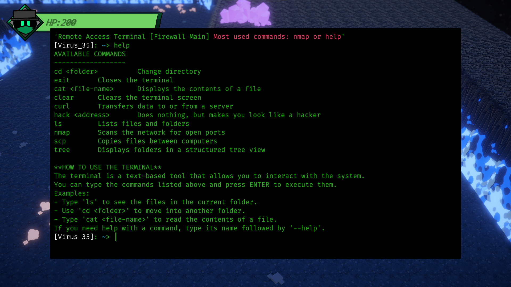
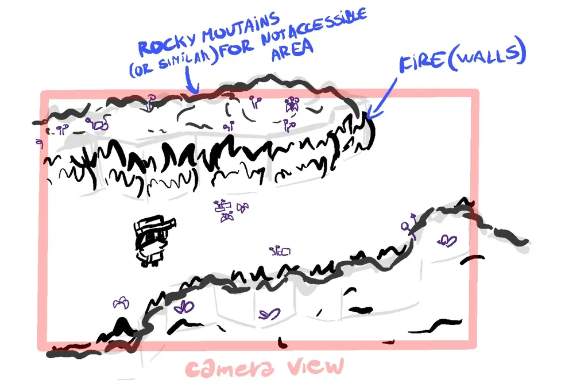

# Uncrypt
*A Cybersecurity Education Game - Contest Entry*


## 📑 Table of Contents
- [Project Overview](#project-overview)
- [About Route 35](#about-route-35)
- [Running the Project](#running-the-project)
- [Key Systems](#key-systems)
- [Visual Design](#visual-design)
- [Educational Content Structure](#educational-content-structure)
- [License & Usage](#license--usage)
- [Connect With Us](#connect-with-us)
- [Code Documentation Disclaimer](#code-documentation-disclaimer)


## Project Overview

**Uncrypt** was developed by **Team Route 35** as a school project (we spent a little over 3 months creating this game...), presenting a unique approach to cybersecurity education. Instead of traditional tutorials, we put players in the shoes of a computer virus to teach them security concepts from an attacker's perspective because understanding how systems are compromised is the first step to protecting them.

More Details can be found in the **Game Design Document**: https://spiny-twister-fd0.notion.site/Uncrypt-GDD-1d7e65d1a24880a2b812d80183b32c4c?pvs=4 

## About Route 35
Route 35 is a creative subteam formed specifically for projects that diverge from Cupflow’s main line of work. Originally, Cupflow was established by Aless and Scstefan as a collaborative identity under which they produced various creative works. For certain projects, such as school-related competitions or experimental releases that fall outside of Cupflow’s typical scope, a new team identity was needed.
Thus, Route 35 was created. It retains Cupflow’s core members and creative style while allowing flexibility in team composition and project direction. For the project in question, Route 35 included Aless, Scstefan, Bluwolf (who contributed modeling, textures, sound effects, and writing), and one additional team member who helped with minor things and preferred to remain anonymous.

Credits for this project
- **Aless** - Developer & VFX Artist (Core systems, visual effects)
- **Scstefan** - Main Artist (Character design, level art)
- **Bluwolf** - 3D Modeler & Sound Designer (Assets, audio systems)

Special thanks to 
- Snake for making most of the game's music (https://www.youtube.com/@S.O-Music)
- Furetto126 for the menu music (https://www.youtube.com/@Furetto126)

### Screenshots

<div style="display: flex; overflow-x: auto; gap: 10px; padding: 10px 0;">
  
  
  
</div>

## Running the Project

### For Players

1. Download the latest build from our itch.io page: https://cupflow-studios.itch.io/uncrypt
2. Extract and run `Uncrypt.exe`
> [!NOTE]
> Please fully extract the game before playing. Running it directly from WinRAR or other archive tools may cause issues.
3. Follow the in-game tutorial!

### For Developers

1. Clone this repository
2. Open in Unity 6
3. Key scenes are located in `/Assets/Scenes/`:
   - `HUB.unity` - Starting area and tutorial
   - `Firewall.unity` - First gameplay area
   - `FileSystem.unity` - Second gameplay area
4. Read through the md files and the GDD to gain additional info about the codebase

> [!WARNING]
> Please note that while we tried to keep the code clean we had to rush some things to meet the project's deadline. If you find something that should be improved let us know in the issues, so we can improve our next projects! 

### Key Gameplay Elements

**Terminal Integration**: We implemented a terminal system that accepts some real Linux commands. Players use `nmap` to scan for open ports, navigate with `cd` and `ls`, and execute simple security tools just like in real-world penetration testing.

**Educational Progression**: Each area introduces new concepts: port scanning in the Firewall, file system navigation in the File System, and decryption mechanics throughout. The learning curve is designed to be accessible to newcomers while remaining similar to actual cybersecurity tools.

**Combat & Exploration**: To keep engagement high, we balanced educational content with action. Players battle antivirus programs,and solve puzzles while learning how protective measures work in reality.

## Key Systems

The main systems we have implemented are:
- **Behaviour Tree** for enemy AI, allowing for complex and responsive behaviors throughout the game.
    ```csharp
    // Example
    BehaviourTree = new BehaviourTreeBuilder("Check Player Status")
                    .StartSequence("Check Player Status")
                        .If("Can View Player", () => CanViewPlayer)
                            .If("Can Attack Player", () => IsNearPlayer)
                                .Then(attack)
                            .Else(patrolSequence)
                        .Else("Idle", () => animator.SetBool(IsPatrolling, false))
                    .Build();
    ```
- **State Machine** for managing the player's move set.
- **Singleton System** for passing references between GameObjects:
    - Persistent Singletons `PersistentSingleton<T>`: These are created at the start of the game and persist across scenes.
    - Scene-specific Singletons `SceneSingleton<T>`: These are temporary and are destroyed when the scene changes.
- **Save System** to allow players to pick up where they left off.
- **Dialogue System** to enable complex dialogues with interactive events and reactions.
- **Terminal System**

For more details look at [Systems.md](./Systems.md)

## Visual Design



### 2.5D Implementation
We chose a 2.5D style combining 2D characters with 3D environments. This approach gave us the performance benefits of 2D sprites while allowing detailed environments.

### Art Pipeline
```
Tools Used:
- Procreate: Character concept art and sprite creation
- Blender: 3D modeling and environment assets
- Unity: Final integration and shader work
```

### Animation System
Characters use a state-based animation system with four core states: Idle, Walk, Alert, and Attack. We implemented direction-based animations using sprite mirroring to avoid drawing unnecessary work load.

## Educational Content Structure

### Firewall Section
Teaches network security fundamentals, including how firewalls filter traffic and the concept of open ports. Players learn to use network scanning tools while navigating volcanic security defenses.

### File System Section
Introduces file system organization and basic cryptography. Players discover encryption keys hidden throughout a peaceful digital landscape, learning about data protection and decryption processes.

### Terminal Integration
Throughout both sections, an interactive terminal teaches real command-line operations used in cybersecurity, from port scanning to file navigation.

### Project Structure
```
Assets/
├── Scripts/                # All game logic and systems
│   ├── BehaviourTree/      # AI behavior tree implementation
│   ├── DialogueSystem/     # Custom dialogue system
│   ├── Terminal/           # CLI implementation
│   ├── Player/             # Player mechanics and state machine
│   ├── Companion/          # AI companion logic and states
│   ├── Enemy/              # Enemy behaviors and mechanics
│   ├── Firewall/           # Firewall area specific code
│   ├── FileSystemLevel/    # File system area code
│   └── HUB/                # Hub area and menu systems
├── Levels/                 # Level-specific assets
│   ├── FileSystem/         # File system environment assets
│   └── Firewall/           # Firewall environment assets
├── Enemies/                # Enemy models, animations, and materials
│   ├── Samurai/            # Firewall samurai enemy
│   ├── MP3/                # File system MP3 enemy
│   └── [Other Enemy Types]
├── NPC/                    # NPC character assets
├── Player/                 # Player character assets and animations
├── Companion/              # AI companion visuals and animations
├── UI/                     # User interface components
│   ├── Dialogue/           # Dialogue UI elements
│   ├── Menu/               # Main menu and navigation
│   └── Pause/              # Pause menu system
├── Scenes/                 # Game scenes
└── SFX/                    # Sound effects library
```

## License & Usage
This project is shared as open source for educational purposes. Feel free to explore our implementations, learn from our approaches, and adapt our systems for your own projects. We ask only that you give us credits if you use significant portions of our work.

## Connect With Us
While this was created for a contest, we'd love to hear from other developers and educators interested in our approach. Feel free to explore the code, ask questions through GitHub issues, or reach out to discuss educational game development.

## Code Documentation Disclaimer
Important Note for Code Reviewers: While exploring our source code, you may encounter AI-generated comments designed to improve code readability and understanding for external readers. These comments were added specifically to help developers navigate and comprehend our custom systems more easily.
Most code implementation, logic, and architecture was written by Team Route 35. The AI assistance was used to explanatory comments and documentation to make our work more accessible to the community.
